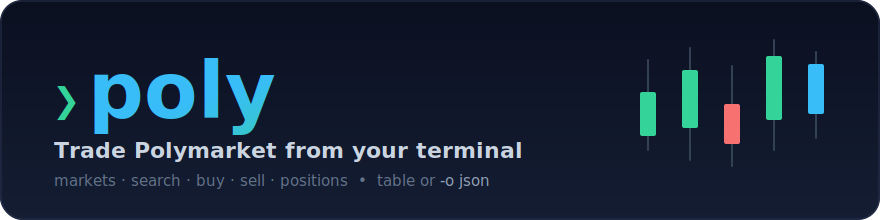
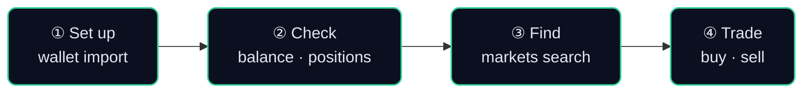

<p align="center">
  
</p>

<p align="center">
  
  
  
  
  
</p>

<p align="center">
  A friendly CLI for trading on <b>Polymarket</b> from your deposit wallet — set up a wallet,
  search markets by keyword, and place orders, as readable tables or <code>-o json</code> for scripts and agents.
</p>

<p align="center">
  Built on the official <b><code>polymarket-client</code></b> SDK (<code>Polymarket/py-sdk</code>), trading from the
  deterministic deposit wallet (signature type 3 / POLY_1271).
</p>

---

## Install

**Prerequisite:** [`uv`](https://docs.astral.sh/uv/) — it manages Python for you, so you don't need a
separate Python install.

```bash
# macOS / Linux
curl -LsSf https://astral.sh/uv/install.sh | sh
# Windows (PowerShell): irm https://astral.sh/uv/install.ps1 | iex
```

### Option A — install as a global command (recommended)

Install straight from GitHub — no clone needed — and get a `poly` command available everywhere:

```bash
uv tool install git+https://github.com/johnsonice/polymarket_cli.git
```

Or from a local clone:

```bash
git clone https://github.com/johnsonice/polymarket_cli.git
cd polymarket_cli
uv tool install .          # add --editable to track your local source changes live
```

Verify, then jump to **The flow** below:

```bash
poly --help
```

> - If your shell can't find `poly` afterward, run `uv tool update-shell` and restart the terminal
>   (uv installs commands into `~/.local/bin`).
> - If install complains about a prerelease dependency, append `--prerelease allow`.
> - Update later with `uv tool upgrade poly-cli`; remove with `uv tool uninstall poly-cli`.

### Option B — run from source (for development)

```bash
git clone https://github.com/johnsonice/polymarket_cli.git
cd polymarket_cli
uv sync --extra dev        # creates .venv with dev deps
uv run poly --help
```

> With Option B there's no global `poly` command — prefix every example below with `uv run`
> (e.g. `uv run poly markets search "world cup"`).

---

## The flow

A full session goes: **① set up your wallet → ② check your account → ③ find a market → ④ trade.**



### ① Set up your wallet

Store your signer key once (the deposit wallet is derived from it automatically):

```bash
poly setup                              # interactive — paste your key when prompted
poly wallet import 0x<your-signer-key>  # or non-interactive
```

The key is saved to `~/.config/polymarket/config.json` (mode `600`). A project `.env` is **not** read.
Resolution order: `--private-key` flag → `POLYMARKET_PRIVATE_KEY` env → config file.
(See [`config.example.json`](config.example.json) for the format.)

```bash
poly wallet show        # your deposit wallet address + config path (never prints the key)
poly wallet address     # just the address
```

### ② Check your account

```bash
poly clob balance --asset-type collateral     # your USDC cash
poly data positions                           # what you hold (defaults to your wallet)
poly data value                               # portfolio value
```

### ③ Find a market

Search by keyword — the table shows each market's **slug** (which you trade with);
full **token ids** and `condition_id` are available with `-o json`:

```bash
poly markets search "world cup"               # keyword search
poly markets get will-usa-win-the-world-cup   # one market by slug / id / URL
poly markets list --limit 20                  # browse open markets
```

Example (`poly markets search "world cup"`):
```
question                                       yes_price  slug
Will Portugal reach the Round of 16 ...        0.745      will-portugal-reach-the-round-of-16-...
Will Mexico reach the Round of 16 ...          0.62       will-mexico-reach-the-round-of-16-...
```
(Tables show a readable subset of columns; `-o json` returns every field.)

### ④ Trade

Always **dry-run first** — it builds and signs the order locally and prints it, but never submits:

```bash
poly buy --slug will-portugal-reach-the-round-of-16 --outcome yes --usd 1 --price 0.75 --dry-run
```

Then place it for real (shows a preview and asks you to type `YES`):

```bash
poly buy  --slug <slug> --outcome yes --usd 1 --price 0.75      # buy $1 of YES at a 0.75 limit
poly sell --slug <slug> --outcome no  --size 10 --price 0.40    # sell 10 NO shares at 0.40
poly buy  --token-id 4636895... --usd 2 --market               # market buy $2 by token id
```

Manage your orders afterward:

```bash
poly clob orders          # open orders
poly clob trades          # your trade history
poly clob cancel <ID>     # cancel one; or `poly clob cancel-all`
```

---

## All commands

Global options (before the command): `-o, --output table|json` (default `table`), `--private-key`.

| Group | Commands |
|---|---|
| *(top level)* | `setup`, `buy`, `sell` |
| `wallet` | `create`, `import`, `show`, `address`, `reset` |
| `markets` | `search`, `get`, `list` |
| `clob` | `create-order`, `market-order`, `post-orders`, `orders`, `order`, `trades`, `balance`, `cancel`, `cancel-orders`, `cancel-market`, `cancel-all` |
| `data` | `positions`, `value` |

`poly buy`/`sell` are friendly aliases for `clob create-order` / `market-order`. Run `poly <group> --help`
or `poly <group> <command> --help` for full options.

## Order options

For `buy`, `sell`, `clob create-order`, and `clob market-order`:

| Flag | Meaning |
|---|---|
| `--token-id` · `--slug` · `--url` | What to trade — pick one. With `--slug`/`--url`, add `--outcome`. |
| `--outcome yes\|no` | Which side of the market (default `yes`). Ignored with `--token-id`. |
| `--usd` · `--size` | Spend N dollars **or** trade N shares. (Limit: either. Market BUY needs `--usd`; market SELL needs `--size`.) |
| `--price` | Limit price per share, between 0 and 1. Required unless `--market`. Rounded to the market tick. |
| `--market` | Market order instead of a limit order. |
| `--max-spend` | Market BUY only: fee-inclusive USD cap (defaults to `--usd`, so you never overspend). |
| `--dry-run` | Build and sign locally, print details, **do not submit**. |
| `--yes` | Skip the typed-`YES` confirmation. |

## JSON output

Add `-o json` before any command for machine-readable output:

```bash
poly -o json markets search "election" | jq '.[].slug'
poly -o json data positions 0x9377... | jq '.[].cash_pnl'
```

## Safety

- Every real submit shows a **preview** and requires typing **`YES`** (skip with `--yes`).
- Use **`--dry-run`** to see exactly what would be sent — signed locally, never submitted.
- Prices/sizes are validated and sent to the SDK as **strings, never floats** (avoiding the legacy
  client's precision bugs). Market BUY is capped by `--max-spend` so fees can't overspend.

## Config & non-default wallet

`~/.config/polymarket/config.json` holds your key (and, optionally, a wallet to trade from):

```json
{
  "private_key": "0x...",
  "wallet_address": "0x..."   // optional — omit to use the default deposit wallet
}
```

## Notes

- **Not** built on `py-clob-client-v2` (Python) or `rs-clob-client-v2` (the Rust CLI) — both are
  outdated trade paths that can't post from deposit wallets.
- `--signature-type` and `clob update-balance` are intentionally absent: the SDK supports only the
  deposit-wallet derivation and has no distinct "refresh balance" call.
- Requires Python ≥3.11; run via `uv`. Tests are offline: `uv run pytest`.
